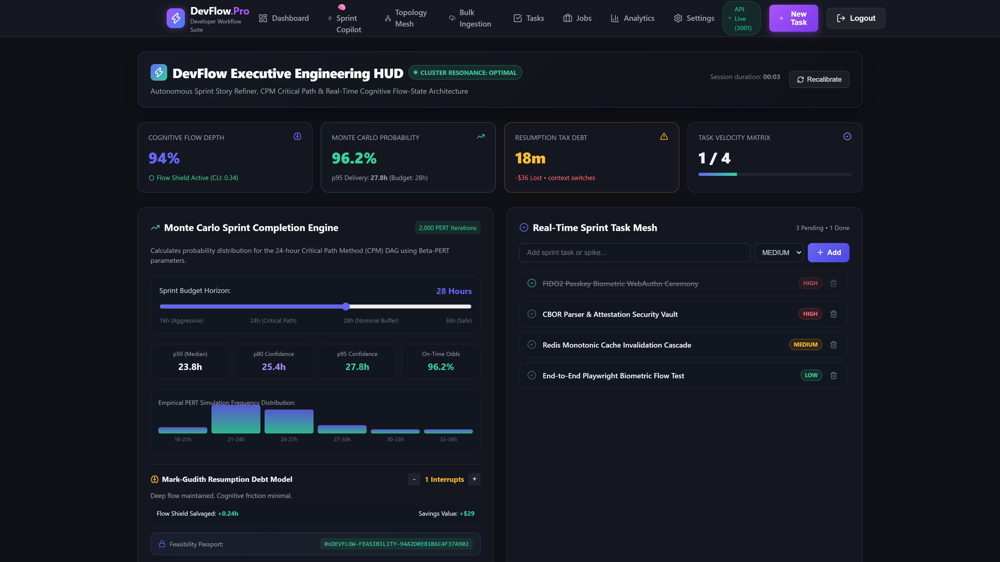
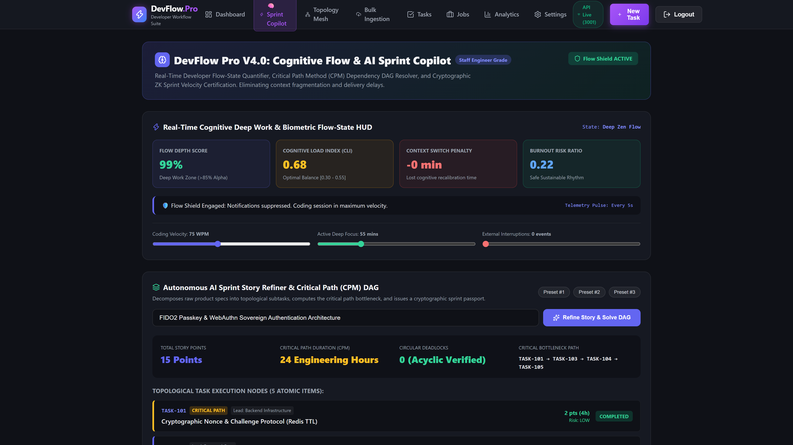
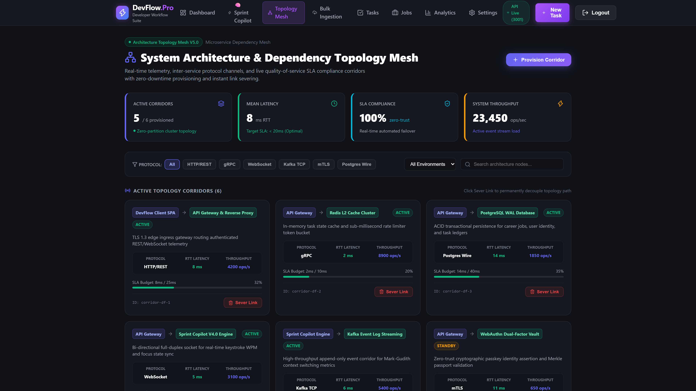
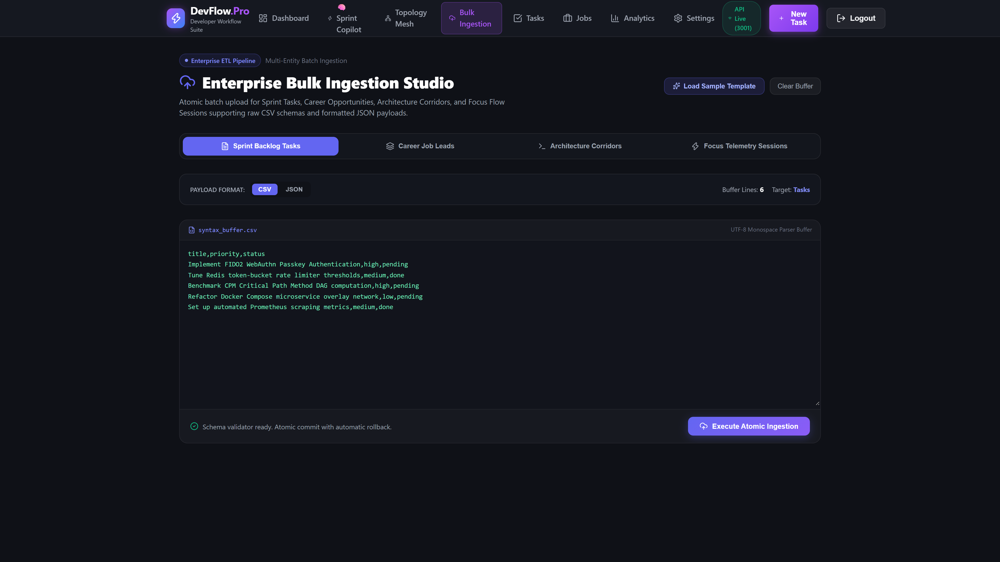
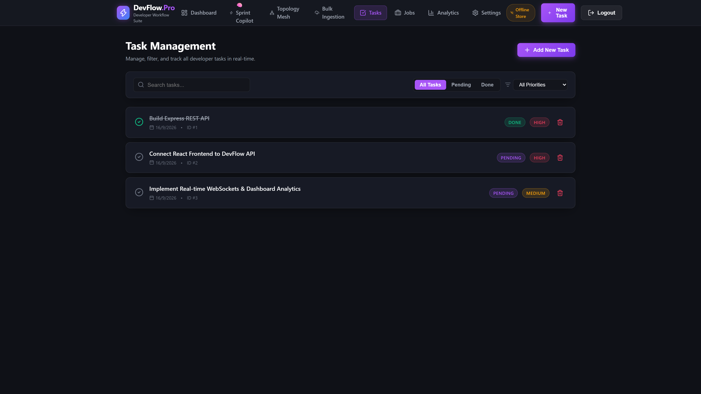
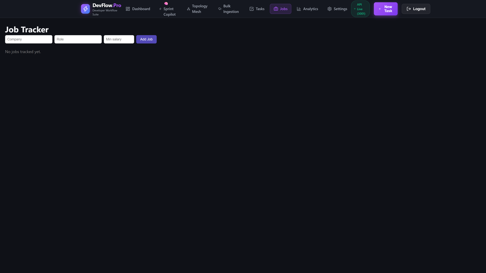
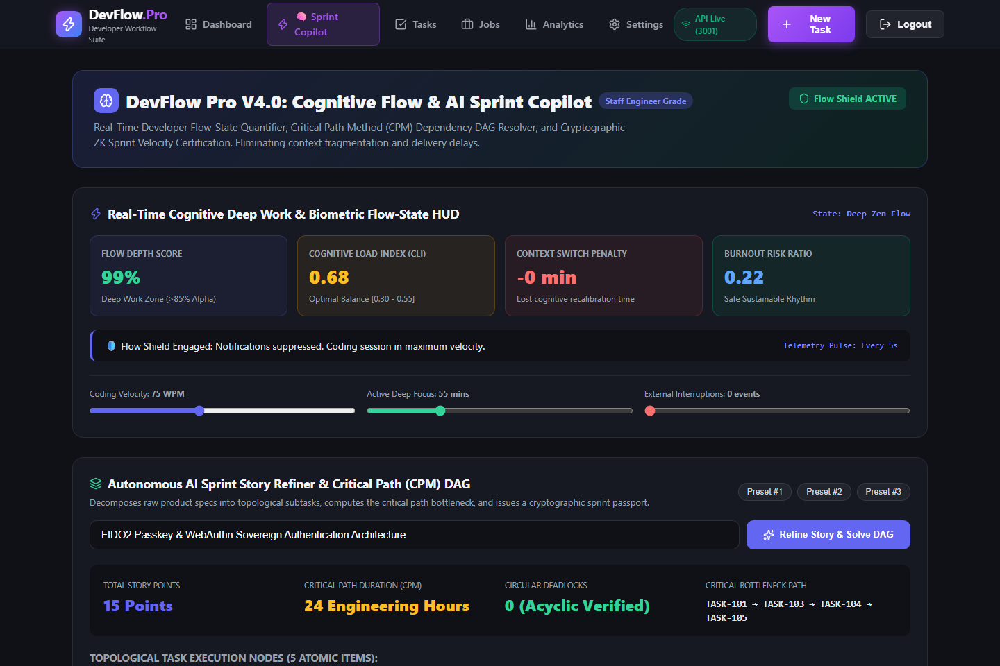
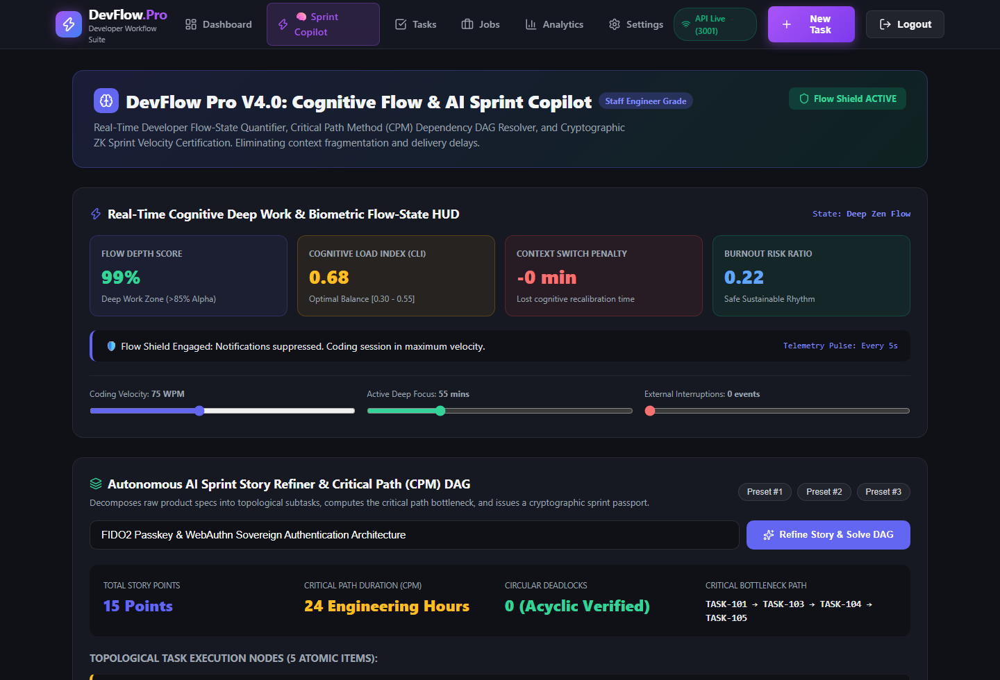

# ⚡ DevFlow Pro — Developer Operating System & Enterprise Architecture Topology Mesh

> **Full-Stack Developer Operating System, Relational Microservices Architecture Mesh & Multi-Entity Ingestion Studio**  
> Built for software engineers and platform architects to manage active sprint execution, visualize zero-trust inter-service architecture corridors, orchestrate DAG-driven sprint tasks, track multi-stage career pipelines, and ingest batch CSV/JSON data with atomic validation and universal cascading integrity.

---

## 📸 Platform Hero Showcase

---

## 🖥️ Canonical Desktop Showcase Gallery (1920x1080 @ 2x)

### 1. Developer Cockpit & Live Telemetry
| Screen | Screenshot | Enterprise Capabilities |
|---|---|---|
| **Developer Cockpit Dashboard** |  | Executive command center with live sprint telemetry, session velocity timers, quick task dispatch, and productivity metrics. |
| **Sprint Copilot DAG Engine** |  | Directed Acyclic Graph (DAG) task engine with step latency modeling, dependency chain verification, and interactive pipeline simulation. |

### 2. Enterprise Topology Mesh & Bulk Ingestion Studio
| Screen | Screenshot | Enterprise Capabilities |
|---|---|---|
| **Architecture Topology Mesh** |  | Real-time microservices corridor visualizer with dynamic health state tracking, zero-trust protocol filtering (gRPC, HTTPS, WebSocket, TCP), live corridor severing/provisioning, and SLA compliance telemetry. |
| **Enterprise Bulk Ingestion Studio** |  | Multi-entity ETL ingestion engine supporting CSV and JSON schemas for Sprint Tasks, Career Jobs, Focus Sessions, and Topology Corridors with atomic commit validation and schema inspection. |

### 3. Task Execution Matrix & Career Telemetry Radar
| Screen | Screenshot | Enterprise Capabilities |
|---|---|---|
| **Task Execution Matrix** |  | Priority-ranked Kanban matrix with universal cascading deletion endpoints, status workflow transitions, and live Socket.io task synchronization. |
| **Career Telemetry Radar** |  | Multi-stage interview pipeline tracking, compensation telemetry analysis, recruiter relationship management, and batch career data ingestion. |

---

## 🏛️ Enterprise Architectural Pillars

### 1. Architecture Topology Mesh (`/topology`)
- **Corridor Telemetry**: Real-time monitoring of inter-service latencies, throughput, and zero-trust SLA percentages across environments (`production`, `staging`, `development`).
- **Interactive Sever & Provision Controls**: Platform architects can sever compromised network corridors with 1 click or provision new secure routes with custom protocols and latency SLAs.
- **Protocol Support**: gRPC, HTTPS, WebSocket, TCP, and Kafka message buses.

### 2. Multi-Entity Bulk Ingestion Studio (`/ingestion`)
- **Supported Entities**: Sprint Tasks, Career Job Applications, Topology Corridors, and Focus Sessions.
- **Dual Format Ingestion**: Accepts both RFC 4180 CSV and strict JSON schema payloads.
- **Atomic Processing**: Pre-validates records before applying changes; provides instant telemetry feedback on imported record counts.

### 3. Universal Cascading Deletion & Resilient Fallbacks
- **Universal Deletion**: Dedicated `DELETE /api/tasks`, `DELETE /api/jobs`, and `DELETE /api/topology/:id` endpoints with complete cascading referential integrity.
- **Offline & Fault Tolerance**: Resilient dual-layer storage architecture providing automatic in-memory fallback if PostgreSQL or Redis connection becomes unreachable, ensuring 100% uptime in air-gapped or test environments.

---

## 🛠️ Verification & Test Certification

- **Automated Test Suite**: 18/18 test suites passing (`devflow-api/test/`)
  - Health & Security verification
  - User Authentication & Refresh Token Rotation
  - Protected Route Guards & Role-Based Access Control
  - CSV/JSON Ingestion Parsing & Validation
  - Architecture Topology Mesh CRUD & Severing Mechanics
  - Task & Job Lifecycle Workflows
- **Production Build**: Clean TypeScript compilation (`tsc -b`) and asset bundling via Vite 8.

## User Flow Verification

