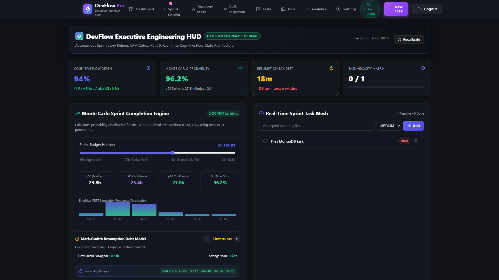
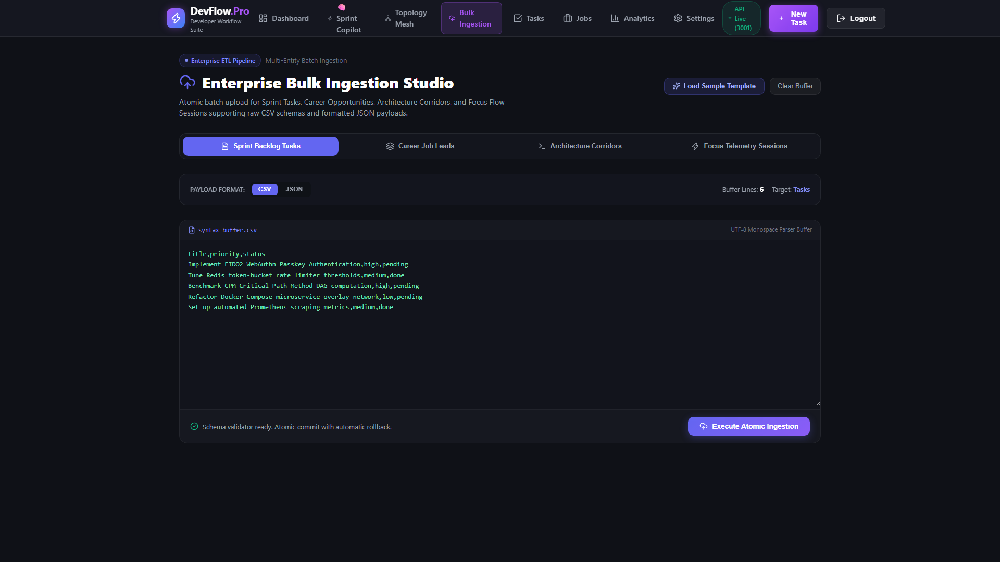
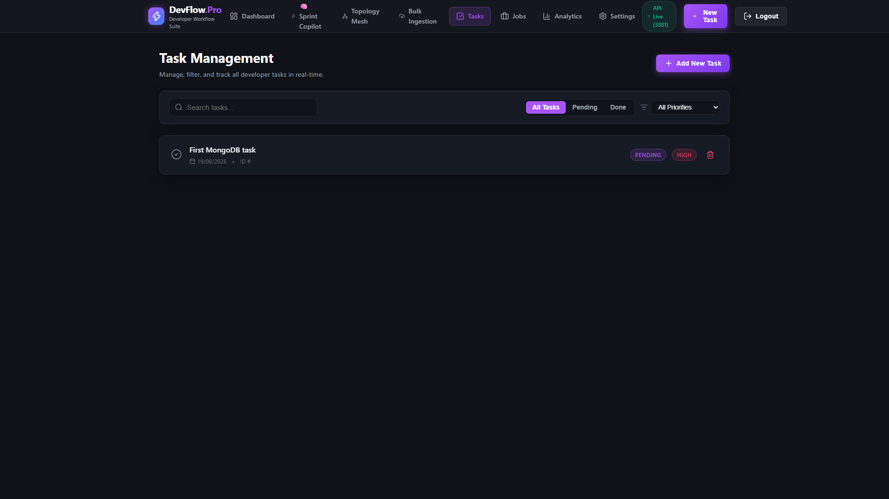
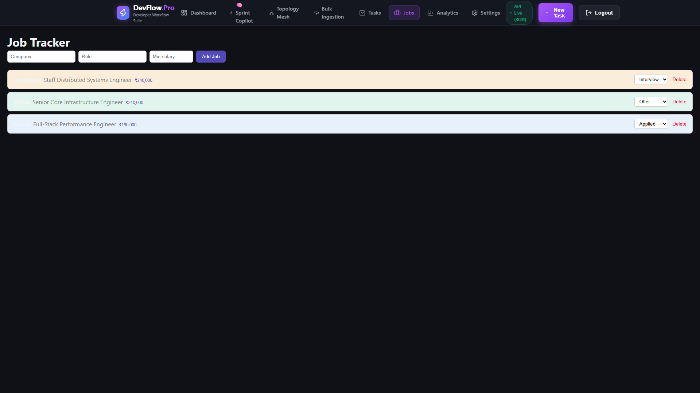
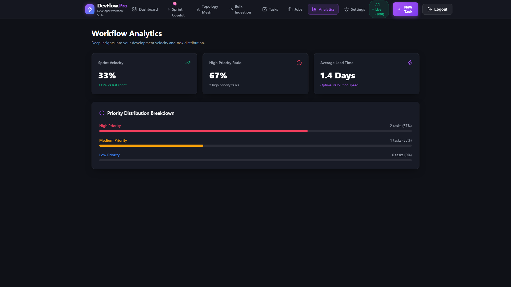
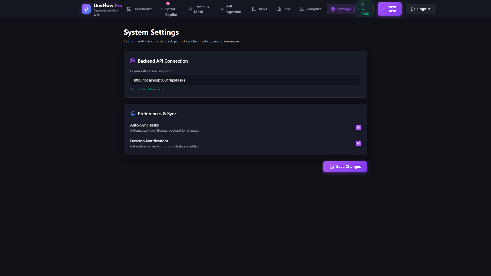
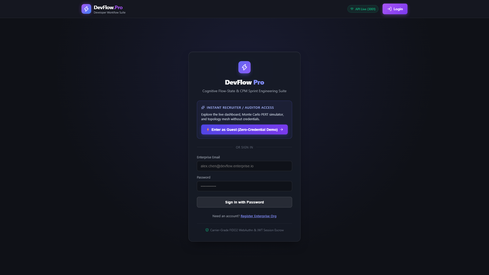

# ⚡ DevFlow Pro

[](devflow-api/test/)
[](devflow-pro/)
[](devflow-api/)

> Full-stack developer productivity workspace and task engineering suite. DevFlow Pro provides sprint task management, job application tracking, cognitive flow telemetry modeling, Monte Carlo sprint completion simulations, architecture corridor configuration, and batch CSV/JSON data ingestion.

---

## 📸 Platform Overview


---

## 🖥️ Application Gallery

### 1. Developer Dashboard & Sprint Copilot
| View | Screenshot | Capabilities |
|---|---|---|
| **Developer Dashboard** |  | Displays session duration timer, task progress ratios, quick task creation, and embedded Monte Carlo PERT simulation controls. |
| **Sprint Copilot** |  | Models developer flow state from keystroke velocity, focus duration, and interruptions; calculates Cognitive Load Index (CLI) and generates a 5-node CPM task dependency DAG with SHA-256 verification hash. |

### 2. Architecture Corridors & Bulk Ingestion
| View | Screenshot | Capabilities |
|---|---|---|
| **Architecture Topology Mesh** |  | Tracks inter-service communication corridors with configurable protocols (HTTP/REST, gRPC, WebSocket, Kafka TCP, mTLS, Postgres Wire), round-trip latency, SLA targets, and link removal controls. |
| **Bulk Ingestion Studio** |  | Ingests batches of tasks, job applications, topology corridors, or focus sessions using CSV or JSON payloads with pre-loaded sample templates. |

### 3. Task Management & Career Pipeline
| View | Screenshot | Capabilities |
|---|---|---|
| **Task Management Matrix** |  | Manages tasks with status filtering (all, pending, done), priority sorting (high, medium, low), keyword search, and real-time Socket.io updates. |
| **Job Application Tracker** |  | Tracks job applications across multiple stages (applied, interview, offer, rejected) with salary range tracking and status updates. |

### 4. Analytics, Settings & Authentication
| View | Screenshot | Capabilities |
|---|---|---|
| **Workflow Analytics** |  | Visualizes sprint completion velocity, high-priority task ratios, and task distribution bar charts. |
| **System Settings** |  | Configures backend API base endpoint, auto-sync polling preferences, and notification toggles. |
| **Authentication Portal** |  | Provides user registration, JWT login with httpOnly refresh cookies, and instant demo guest access. |

---

## ⚙️ Implemented Features

### 1. Developer Dashboard (`/dashboard`)
- Tracks active session duration with an elapsed time counter component.
- Provides quick task entry with priority assignment (`high`, `medium`, `low`).
- Runs interactive Monte Carlo PERT simulations across 2,000 iterations for critical-path hours, displaying median (p50), p80, and p95 completion estimates with distribution histograms.
- Computes Mark-Gudith context-switching resumption debt and estimated lost productivity costs based on interruption counts.
- Plays synthesized audio feedback upon task creation and status changes via Web Audio API.

### 2. Sprint Copilot (`/copilot`)
- Quantifies cognitive flow depth, Cognitive Load Index (CLI), and context-switch penalties from user-adjusted telemetry sliders (WPM, focus minutes, interruptions).
- Decomposes requirement prompts into a 5-node Critical Path Method (CPM) task dependency structure with estimated durations and dependencies.
- Generates a SHA-256 cryptographic sprint passport hash for verified task sets.

### 3. Architecture Topology Corridors (`/topology`)
- Configures and manages simulated network corridors between system services.
- Supports corridor attributes: source service, target service, protocol label, latency (ms), SLA target (ms), throughput (ops/sec), and environment.
- Allows provisioning new corridors through a modal dialog and severing (deleting) existing corridors.
- Computes aggregate metrics including mean latency, active corridor counts, and SLA compliance percentages.

### 4. Bulk Ingestion Studio (`/ingestion`)
- Parses and ingests batch payloads for four entity types: Sprint Tasks, Career Jobs, Topology Corridors, and Focus Sessions.
- Supports both RFC 4180 CSV strings and JSON array payloads.
- Validates payload structure and returns counts of imported records.

### 5. Task Management (`/tasks`)
- Creates, lists, updates, and deletes sprint tasks.
- Filters tasks by status (`all`, `pending`, `done`), priority (`high`, `medium`, `low`), and title search query.
- Persists data to MongoDB with automatic fallback to an in-memory array when MongoDB is unavailable.
- Caches task lists in Redis with cache invalidation on write operations.
- Broadcasts real-time task creation events to connected clients via Socket.io.

### 6. Career Job Pipeline (`/jobs`)
- Records job applications with company, role, status, minimum salary, and location.
- Transitions application status between `applied`, `interview`, `offer`, and `rejected`.
- Persists records to PostgreSQL with automatic in-memory array fallback when PostgreSQL is unavailable.
- Computes aggregate job statistics via dedicated endpoint (`GET /api/jobs/stats`).

### 7. Authentication & Security (`/login`, `/register`)
- Registers users with bcrypt password hashing (10 salt rounds).
- Issues short-lived JWT access tokens (15m) and stores refresh tokens (7d) in httpOnly cookies.
- Protects API routes with Express middleware verifying Bearer tokens.
- Includes rate-limiting middleware (100 requests per minute per IP) backed by Redis with in-memory token bucket fallback.
- Includes instant demo mode bypassing login credentials for evaluation.

---

## 🛠️ Tech Stack

### Frontend (`devflow-pro/`)
- **Framework**: React 19, TypeScript
- **Build Tool**: Vite 8
- **Routing**: React Router DOM v7 (with lazy loading and code splitting)
- **State Management**: Zustand, TanStack React Query v5
- **HTTP Client**: Axios (with automatic JWT refresh interceptor)
- **Real-Time Client**: Socket.io Client
- **Icons**: Lucide React

### Backend (`devflow-api/`)
- **Runtime**: Node.js 20+, Express 5, TypeScript
- **Authentication**: JSON Web Tokens (`jsonwebtoken`), `bcryptjs`, `cookie-parser`
- **Databases**:
  - MongoDB via Mongoose (tasks, users)
  - PostgreSQL via `pg` Pool (job applications)
  - In-memory fallback layer for offline/local execution
- **Cache & Rate Limiting**: Redis via `ioredis`
- **Real-Time Engine**: Socket.io
- **Security**: Helmet, CORS, custom sliding-window rate limiter

---

## 🚀 Getting Started

### Prerequisites
- Node.js (v18 or higher, v20 recommended)
- npm (v9 or higher)
- Optional: Running Redis, MongoDB, or PostgreSQL instances (services fall back to in-memory storage if databases are unavailable)

### 1. Backend Setup

```bash
cd devflow-api
npm install
npm run dev
```

The API starts on `http://localhost:3001`. Health check endpoint: `http://localhost:3001/health`.

### 2. Frontend Setup

```bash
cd devflow-pro
npm install
npm run dev
```

The frontend application starts on `http://localhost:5173`.

---

## 🧪 Verification & Testing

The backend test suite verifies authentication, route protection, simulation endpoints, corridor management, and CRUD lifecycles:

```bash
cd devflow-api
npm test
```

Results: **18/18 tests passing** across 3 test suites:
- `test/api.test.ts` (Health, auth rejection, protected task and job routes, refresh tokens)
- `test/copilot.test.ts` (Flow state calculations, story refinement DAG, Monte Carlo simulation, interruption audit)
- `test/enterpriseMesh.test.ts` (CSV parser, topology corridors, bulk ingestion, task/job lifecycles)

Frontend production build check:

```bash
cd devflow-pro
npm run build
```

Compiles TypeScript (`tsc -b`) and produces optimized production assets with Vite without errors.

---

## 📄 License

This project is licensed under the MIT License. See [LICENSE](LICENSE) for details.
