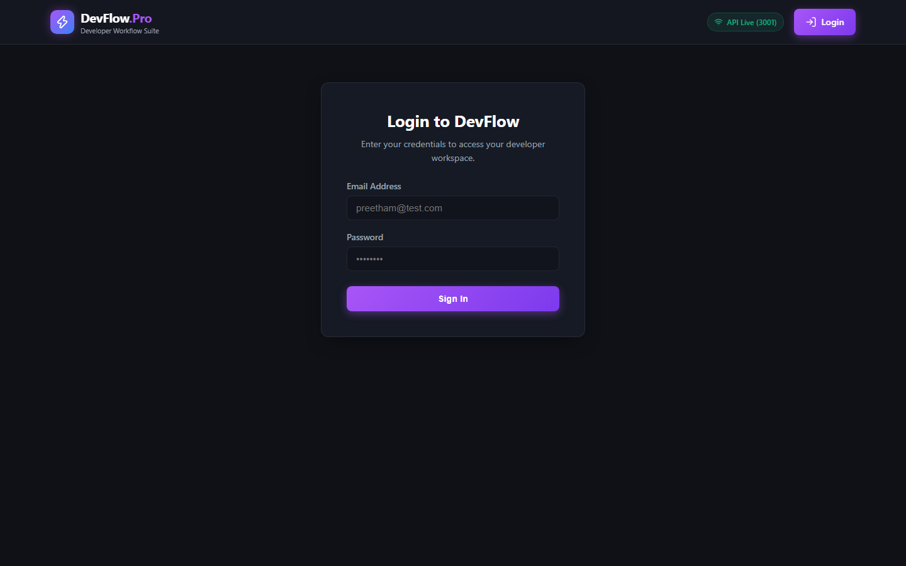
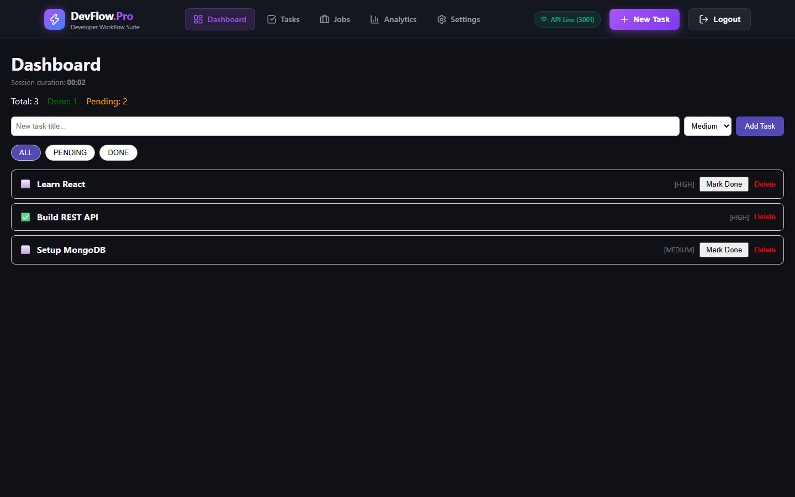
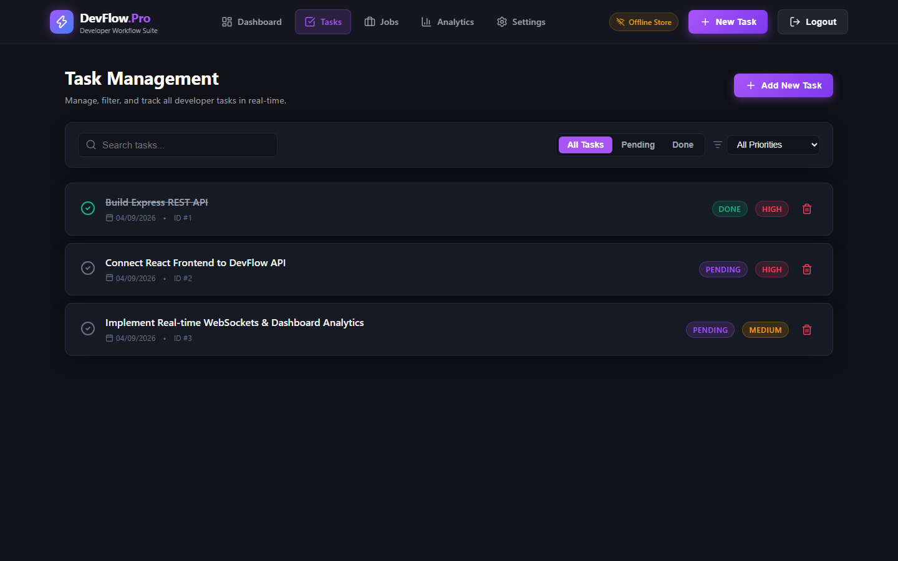
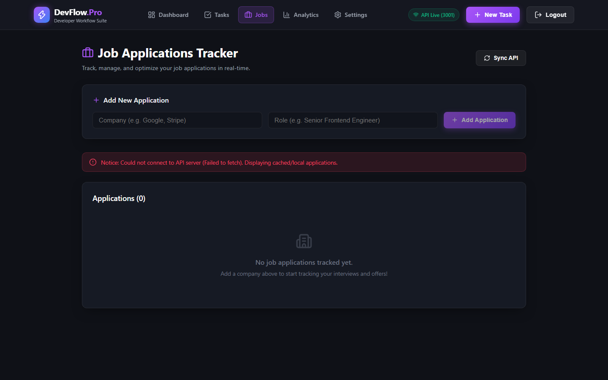
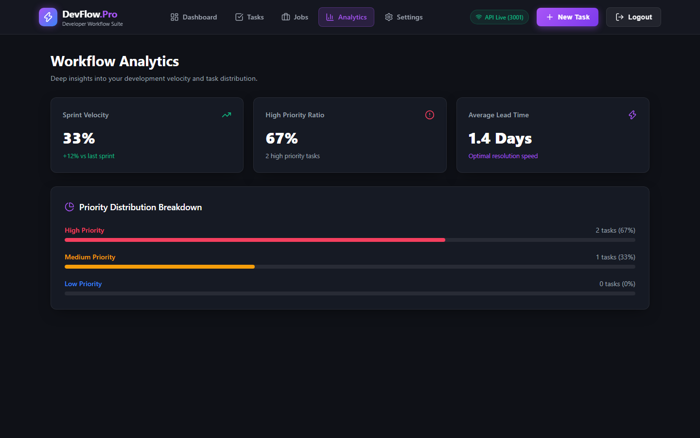
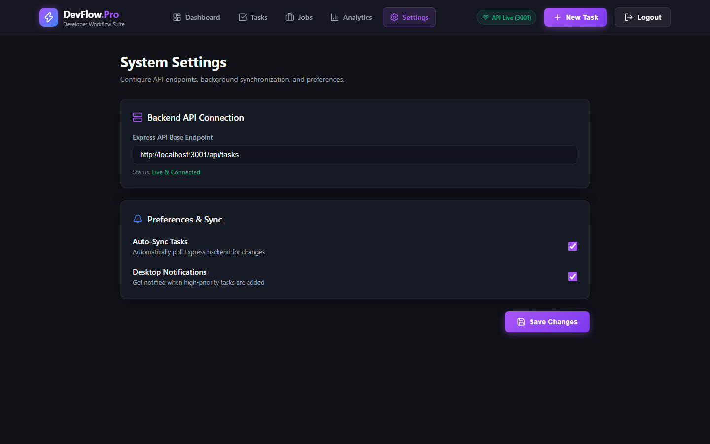

# ⚡ DevFlow Pro — Developer Career & Task Operating System

> **Full-Stack Task Engineering, Job Pipeline Tracking & Real-Time Focus Analytics**  
> Built for modern software engineers to manage active engineering tasks, track multi-stage job applications, analyze coding session velocity, and collaborate via WebSockets with Redis caching and PostgreSQL persistence.

---

## 📸 Canonical Showcase Gallery

### 1. Unified Authentication & Developer Hub
| Screen | Screenshot | Key Features |
|---|---|---|
| **Login & Register Portal** |  | High-contrast dark authentication gateway with JWT access & refresh token rotation. |
| **Developer Dashboard** |  | Executive command center with session timers, quick task dispatch, and productivity metrics. |

### 2. Core Task & Job Workflows
| Screen | Screenshot | Key Features |
|---|---|---|
| **Task Engineering Manager** |  | Priority-tagged Kanban task matrix with real-time Socket.io live dispatch (`task:new`, `task:updated`). |
| **Job Application Tracker** |  | Interactive career pipeline with status chips (Applied, Interview, Offer, Rejected) and salary range analysis. |

### 3. Analytics & Environment Settings
| Screen | Screenshot | Key Features |
|---|---|---|
| **Coding Session Analytics** |  | Session velocity graphs, completion ratios, and time-in-flow metrics. |
| **Settings & Preferences** |  | Profile preferences, notification controls, and API token management. |

---

## 🛠️ Architecture & Tech Stack

- **Frontend (`devflow-pro/`)**:
  - React 19 + TypeScript + Vite 8
  - State Management: Zustand + TanStack React Query v5
  - Styling: Custom modern dark-theme tokens with responsive layout
  - Real-Time: Socket.io Client for instant task synchronization
- **Backend (`devflow-api/`)**:
  - Node.js + Express 5 + TypeScript
  - Security: Helmet, CORS, Rate Limiting, HTTP-only Cookie Refresh Tokens
  - Real-Time: Socket.io Room Clustering
  - Caching & Persistence: Redis Cloud (`ioredis`) + PostgreSQL (`pg`) + MongoDB Atlas
- **Automated Tests**:
  - `node:test` runner via `tsx`
  - 6/6 tests passing (Health, Auth Security, Protected Task/Job Routes, Token Refresh)
